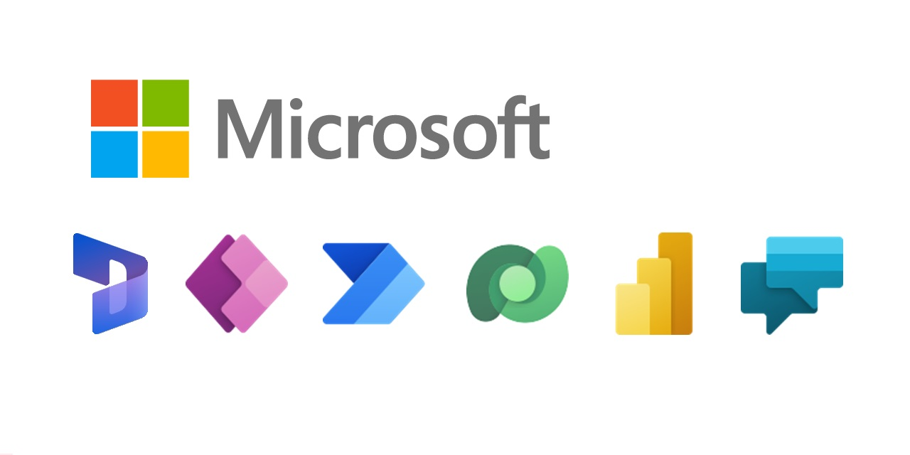

# GBB-Business-Applications

Welcome to the Global Black Belt Business Applications Demo Repository.  This repository was created to showcase sample solutions that run in the Power Platform and D365 in our various cloud offerings. 





## Demos

Below is a listing of the sample solutions available.  These sample solution files are meant for demonstration purposes only to quickly showcase various features across our platform.  

| Demo Name

| [D365 Click To Dial From Teams](https://github.com/microsoft/Federal-Business-Applications/blob/main/demos/d365-click-to-dial-teams/README.md)
| [Real-Time License Assign with GraphAPI](demos/d365-realtime-license-assign/README.md)

## Whitepapers - Coming Soon

## Training Resources

### Power Apps / Power Automate

* [App in a Day](https://aka.ms/aiad)
* [RPA in a Day](https://aka.ms/rpainaday)
* [Power Platform Learning Paths](https://docs.microsoft.com/en-us/learn/powerplatform/)
* [Power Platform Center of Excellence Starter Kit](https://docs.microsoft.com/en-us/power-platform/guidance/coe/starter-kit)
* [Power CAT Adoption Maturity Model](https://powerapps.microsoft.com/en-us/blog/power-cat-adoption-maturity-model-repeatable-patterns-for-successful-power-platform-adoption/)
* [AI Builder Labs](https://docs.microsoft.com/en-us/ai-builder/learn-ai-builder)

### D365

* [D365 Learning Paths](https://docs.microsoft.com/en-us/learn/dynamics365/)
* [D365 Certifications](https://docs.microsoft.com/en-us/learn/certifications/browse/?technology=Microsoft%20Dynamics%20365&products=dynamics-365)

### Power BI

* [Power BI Learning Paths](https://docs.microsoft.com/en-us/power-bi/guided-learning/)
* [Guy in a Cube YouTube Channel](https://www.youtube.com/channel/UCFp1vaKzpfvoGai0vE5VJ0w)
* [Power BI Training Content](https://aka.ms/PBITraining)
* [Power BI Dashboard in an Hour Lab](https://aka.ms/pbi-diah)
* [Power BI Paginated Reports in a Day YouTube Training](https://www.youtube.com/playlist?list=PL1N57mwBHtN1icIhpjQOaRL8r9G-wytpT)
* [Power BI Adoption Framework](https://www.youtube.com/playlist?list=PL1N57mwBHtN0UZbEgLHtA1yxqPlae3B90)

## Contributing

This project welcomes contributions and suggestions.  Most contributions require you to agree to a
Contributor License Agreement (CLA) declaring that you have the right to, and actually do, grant us
the rights to use your contribution. For details, visit https://cla.opensource.microsoft.com.

When you submit a pull request, a CLA bot will automatically determine whether you need to provide
a CLA and decorate the PR appropriately (e.g., status check, comment). Simply follow the instructions

provided by the bot. You will only need to do this once across all repositories using our CLA.


This project has adopted the [Microsoft Open Source Code of Conduct](https://opensource.microsoft.com/codeofconduct/).
For more information see the [Code of Conduct FAQ](https://opensource.microsoft.com/codeofconduct/faq/) or
contact [opencode@microsoft.com](mailto:opencode@microsoft.com) with any additional questions or comments.

## Contributing Guidelines and Folder Naming Conventions

If you want to add a new demo or whitepaper, follow the folder structure convention below,

```
demos/
├─ your-new-demo-folder/
│  ├─ files/
│  │  ├─ image1.PNG
│  │  ├─ image2.PNG
│  │  ├─ sampleSolution.zip
│  ├─ README.md
whitepapers/
├─ your-new-whitepaper-folder/
│  ├─ files/
│  │  ├─ image1.PNG
│  ├─ README.md
├─ your-new-whitepaper2-folder/
│  ├─ summary.pdf
README.md
```

You can decided if you would rather have a ```README.md``` file with Markdown syntax, or if you prefer, you can convert a document into a PDF file and then upload that into the subfolder for the demo/whitepaper.  PDF's will render in the browser when viewed on GitHub.

Lastly, link from this main ```README.md``` page to your new demo/whitepaper and the corresponding ```README.md``` or PDF file.

## Trademarks

This project may contain trademarks or logos for projects, products, or services. Authorized use of Microsoft 
trademarks or logos is subject to and must follow 
[Microsoft's Trademark & Brand Guidelines](https://www.microsoft.com/en-us/legal/intellectualproperty/trademarks/usage/general).
Use of Microsoft trademarks or logos in modified versions of this project must not cause confusion or imply Microsoft sponsorship.
Any use of third-party trademarks or logos are subject to those third-party's policies.
